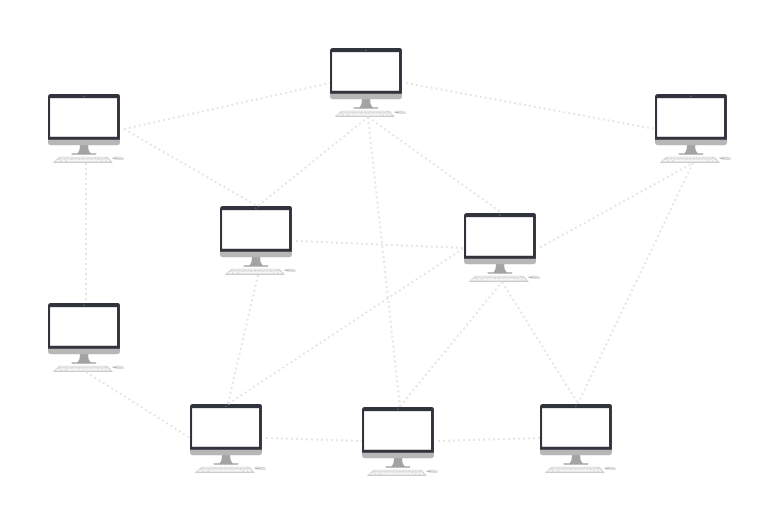
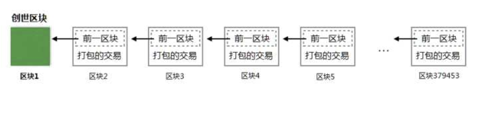
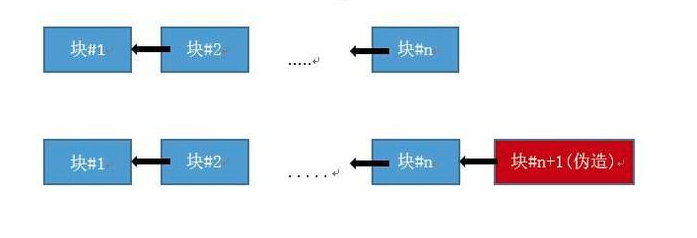

## 传统中心化系统


如果A向B转账 100 人民币:
1. A 向银行提出请求
2. 银行对A的身份进行校验(密码)，并验证A的账户余额是否有100元
3. 通过后，银行添加一条转账记录 【A向B转账100元】
4. 银行在数据库将A的余额扣掉100，B的账户添加100

## 比特币的去中心化系统

比特币是一个去中心化的账本， 每个客户端都作为P2P的节点存在于网络并自己拥有一份完整的账本


如果A向B转账 1 比特币:
1. A向周围节点广播转账交易请求：A向B转账1个比特币，并用A账号的私钥签名
2. A周围的节点收到请求之后，通过A账号的公钥检查交易的真伪，并且检查A账户是否有足够的余额
3. 检查通过后，节点在自己的账本记录：A向B转账1比特币
4. 节点将此交易广播给周围节点，依此扩散直到所有的节点都收到这笔交易。

## 区块链



比特币两个节点互联时需要同步彼此的所有交易信息，区块链就是用于保证所有节点数据的统一，并通过竞争区块打包权的方式，保证了区块链的唯一性。
- 以区块为单位同步交易数据
- 打包区块奖励: 为保证有节点打包比特币交易，比特币规定打包交易的节点将获得比特币作为酬劳。
- 竞争区块打包权: 节点打包交易只需消耗很低的成本和计算资源。通过扔硬币决定谁来打包
- 获胜节点打包区块，并广播出去，验证无误之后，咱们就去扔下一个区块的硬币了。

## 代码

```Swift
struct Transaction {
    let sender: String
    let recipient: String
    let amount: Int
}

struct Block {
    let index: Int
    let timestamp: TimeInterval
    let transactions: [Transaction]
    let proof: String
    let previousHash: String

    func json() -> String {
        return ""
    }
}

struct BlockChain {
    var blocks = [Block]()
    var currentTransactions = [Transaction]()
    var nodes = Set<String>()

    init() {
//        createBlock(proof: "100", previousHash: "1")
    }

    mutating func createTransaction(from sender: String, to recipient: String, amount: Int) -> Int {
        let transaction = Transaction(sender: sender,
                                      recipient: recipient,
                                      amount: amount)
        self.currentTransactions.append(transaction)
        // 广播
        // 返回交易所处的区块
        return blocks.last?.index + 1 ?? 0
    }
    @discardableResult
    mutating func createBlock(proof: String, previousHash: String) -> Block {
        let block = Block(index: self.blocks.count,
                          timestamp: Date().timeIntervalSince1970,
                          transactions: currentTransactions,
                          proof: proof,
                          previousHash: previousHash)

        currentTransactions.removeAll()

        blocks.append(block)

        return block
    }

    func hash(_ block: Block) -> String {
        return sha256(block.json())
    }
}


//扔硬币 - 工作量证明
//工作量证明算法【寻找一个数字满足某一条件，这个数字很难计算出来，但是很容易验证】
extension BlockChain {
    func workToProof(of lastProof: String) -> String {
        var proof = 0
        while !isValid(proof: String(proof), lastProof: lastProof) {
            proof += 1
        }

        return String(proof)
    }
    func isValid(proof: String, lastProof: String) -> Bool {
        let output = sha256(proof + lastProof)

        return output.hasPrefix("0000")
    }
}


//同步不同节点的数据
//网络当中【最长的】【有效的】链才是实际的链
extension BlockChain {
    mutating func register(node: String) {
        nodes.insert(node)
    }
    // 判断某一条链是否是有效的，
    func isValid(chain: [Block]) -> Bool {
        for index in 1..<chain.count {
            let currentBlock = chain[index]
            let previousBlock = chain[index - 1]

            if currentBlock.previousHash != hash(previousBlock) {
                return false
            }
            if !isValid(proof: currentBlock.proof, lastProof: previousBlock.proof) {
                return false
            }
        }
        return true
    }
    // 使用网络当中最长的链解决冲突
    mutating func resolveConflicts() -> Bool {
        let maxChain = nodes
            .map { Network.readChain(of: $0) }
            .filter { isValid(chain: $0) }
            .sorted(by: { $0.count > $1.count })
            .first
        if let maxChain = maxChain {
            self.blocks = maxChain
            return true
        } else {
            return false
        }
    }
}


```

## 比特币当前问题

### 网络阻塞

比特币目前使用1mb作为一个区块的大小。由于交易量太大，交易处于很多个区块后面，延迟。

### 51% 算力攻击

1. Alice 和 Bob之间使用比特币完成了一杯咖啡的交易，因为是小额交易，Bob在收到Alice的转账通知(不是交易确认的通知，只是表面发起了交易)就给Alice提供了咖啡
2. 正常情况下，这笔交易会马上被放入交易池等待挖矿节点把自己加入一个新的区块并开始努力"挖矿"
3. 假设Alice就是那个大boss，拥有网络51%的算力，他真的不愿意为这笔咖啡付钱(有钱人也可能很小气)，于是他开始攻击了
4. 网络上很多节点都收到了这笔交易并加入区块准备运算了，Alice也同样开始贡献算力，但是在开始之前他把区块里的这笔交易改了，本来这是一笔Alice付款给Bob的交易，被改成Alice转给自己的一笔交易了(更改很容易，只要把接收地址和签名改掉即可)
5. Alice开始尝试用这个伪区块进行计算(计算正确后这个快会被加入主块中)，因为拥有51%的算力，Alice比别的节点更容易优先计算成功，导致一个伪造的区块加入了主链。现在网络中有两个区块链:

