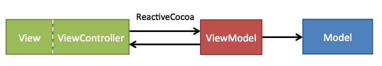

# iOS 之 MVC & MVVM

### MVC 和 MVVM Intro

MVC模式最早由Trygve Reenskaug在1978年提出，是施乐帕罗奥多研究中心（Xerox PARC）在20世纪80年代为程序语言Smalltalk发明的一种软件架构。主要构成为 Model View Controller。

MVVM由微软架构师Ken Cooper和Ted Peters开发，通过利用WPF（微软.NET图形系统）和Silverlight（WPF的互联网应用派生品）的特性来简化用户界面的事件驱动程序设计。

MVVM 核心构成除了MVC 中的V和M之外还有VM 和 Binder。

- 视图模型(VM)
视图模型是暴露公共属性和命令的视图的抽象。在视图模型中，绑定器在视图和数据绑定器之间进行通信。
- 绑定器(Binder)
声明性数据和命令绑定隐含在MVVM模式中。在Microsoft解决方案堆中，绑定器是一种名为XAML的标记语言。绑定器使开发人员免于被迫编写样板式逻辑来同步视图模型和视图。在微软的堆之外实现时，声明性数据绑定技术的出现是实现该模式的一个关键因素。

那么在Keep 项目中，从最早的MVC，到后面尝试使用MVVM。我们两种设计模式都在使用，设计模式没有好坏之分，在适合的场景使用上更加符合其的架构是相当重要的，所以我们在介绍MVC 和 MVVM 基础的用法后，在一些持有关系、开发中用到的一些Tips 也做了一些整理，可以一同探讨。

# Architecture
MVC 

MVC 数据流向和持有关系

- Controller 持有 View 和 Model
- View 通过weak delegate、block、notification等回调 Controller 
- View 可以持有Model，主要是用户回调时获取数据
- Model 不持有 Controller 和 View

MVVM

VM 的作用 
- 数据加工者
- 通过ViewModel 进行V 和 M的交互
- View 对应的 VM

MVVM 数据流向和持有关系

- VC 建立VM 和 V 的双绑定
- View通过ViewModel与Model交互，不可跨越ViewModel直接操作Model
- ViewModel呈现给View的Model是经过处理后的数据模型状态

在iOS 的 MVVM 设计中，我们使用RAC 作为Binder

# Tips
MVC 做的时候的一些可参考的tips
- Model, View, Controller 相互持有关系不能混乱、倒置
- Controller 作为 MVC 的中心
- 从Controller中拆分DataSource，Storage等, 拆代码的时机是文件超过600-800行
- 复杂页面使用 Child ViewController 组织时

#Q & A
##MVC 

####胖Model做什么
 
只做数据相关的helper方法，不做网络请求。

####View 可以持有Model

仅用于配置 View 和 事件回调

####View 中可以自己处理部分简单事件

比如点击头像 push 到用户个人页面 Controller，直接调用 Director 即可

####Controller 中 Sub View 的数量
不超过4个

##MVVM

####网络请求的位置

iOS中网络请求的具体实现放在ViewModel中，ViewModel对外暴露接口方法；

####Model

MVVM中Model放在ViewModel中，并且对于View是不可直接访问的「表现形式为readonly」.

####Model与View的交互

MVVM中View是对不同状态的数据模型的展现，View不可跨越ViewModel直接控制Model，ViewModel通过暴露只读属性的形式展现Model「这个Model可能是网络层回调的字典原型也可能是经过ViewModel处理后的数据状态」

####Bind

在ViewController中通过RAC将ViewModel暴露的数据状态绑定

# Slide Share
[Link
](https://docs.google.com/presentation/d/1qsb8sVVGJijKqiwP_owfnzwpYwgzPFW-cvHX2Dotz-M/edit?usp=sharing)

### MVVM Code Repo
[https://github.com/jackrex/RACLoginDemo.git
](https://github.com/jackrex/RACLoginDemo.git)